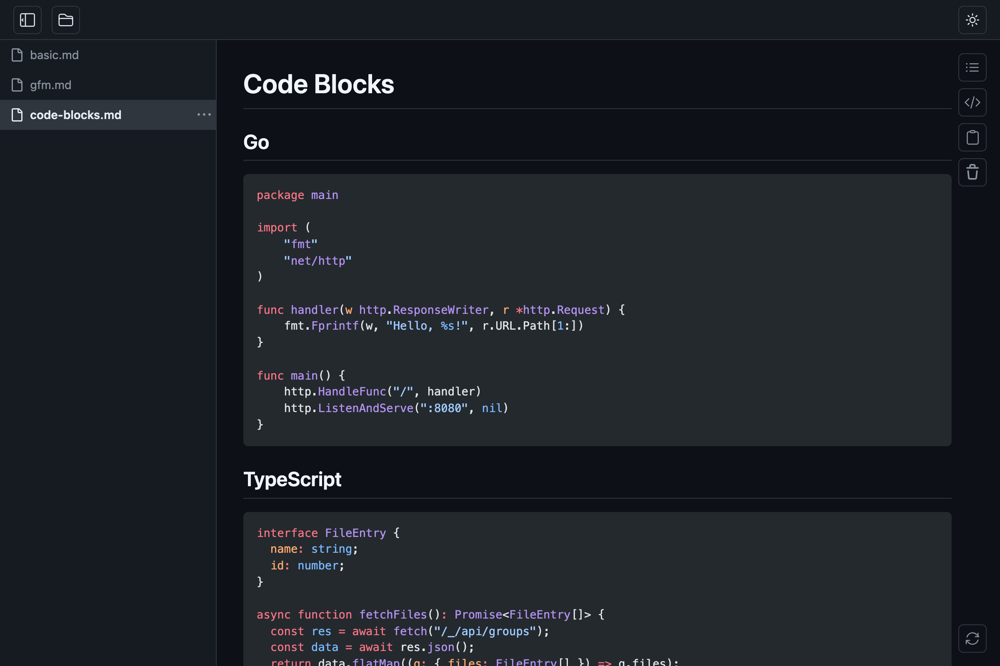
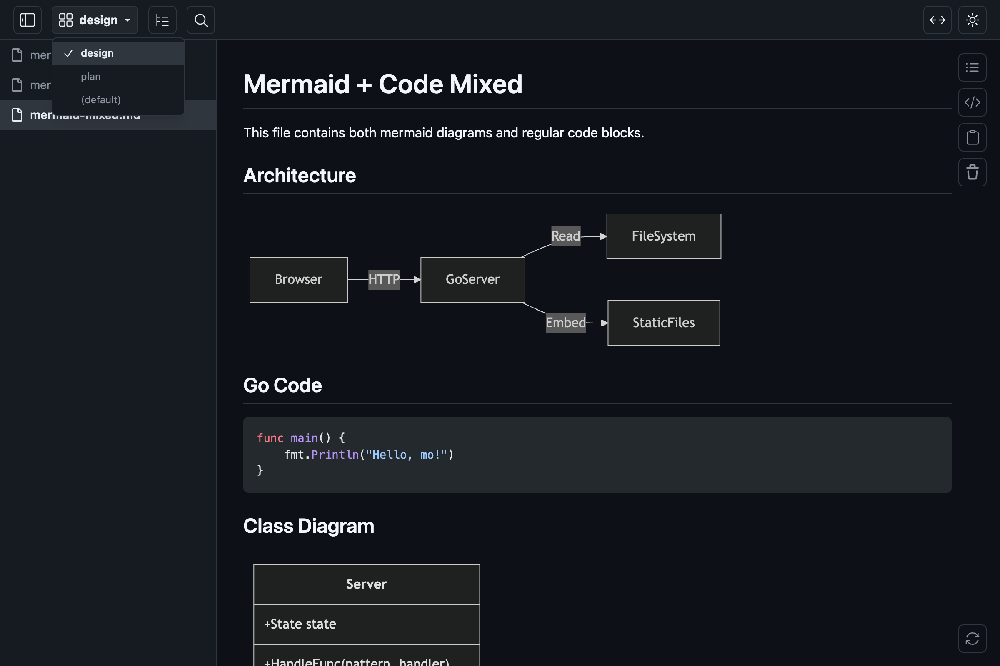
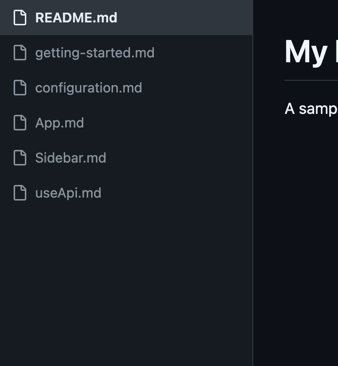
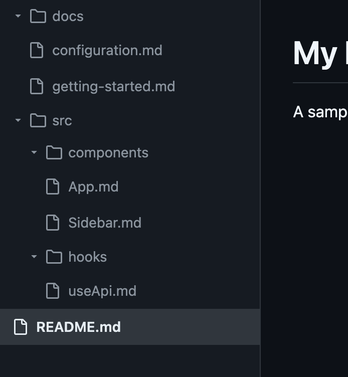

<p align="center">
<br><br><br>

<br><br><br>
</p>

# mo

[](https://github.com/k1LoW/mo/actions/workflows/ci.yml)   

`mo` is a **M**arkdown viewer that **o**pens `.md` files in a browser.

## Features

- GitHub-flavored Markdown (tables, task lists, footnotes, etc.)
- Syntax highlighting ([Shiki](https://shiki.style/))
- [Mermaid](https://mermaid.js.org/) diagram rendering
- Dark / light theme
- File grouping
- Table of contents panel
- Flat / tree sidebar view with drag-and-drop reorder
- Live-reload on save

## Install

**homebrew tap:**

```console
$ brew install k1LoW/tap/mo
```

**manually:**

Download binary from [releases page](https://github.com/k1LoW/mo/releases)

## Usage

``` console
$ mo README.md                          # Open a single file
$ mo README.md CHANGELOG.md docs/*.md   # Open multiple files
$ mo spec.md --target design            # Open in a named group
```

`mo` opens Markdown files in a browser with live-reload. When you save a file, the browser automatically reflects the changes.

### Single server, multiple files

By default, `mo` runs a single server process on port `6275`. If a server is already running on the same port, subsequent `mo` invocations add files to the existing session instead of starting a new one.

``` console
$ mo README.md          # Starts a server and opens the browser
$ mo CHANGELOG.md       # Adds the file to the running server
```

To run a completely separate session, use a different port:

``` console
$ mo draft.md -p 6276
```



### Groups

Files can be organized into named groups using the `--target` (`-t`) flag. Each group gets its own URL path and sidebar.

``` console
$ mo spec.md --target design      # Opens at http://localhost:6275/design
$ mo api.md --target design       # Adds to the "design" group
$ mo notes.md --target notes      # Opens at http://localhost:6275/notes
```



### Sidebar view modes

The sidebar supports flat and tree view modes. Flat view shows file names only, while tree view displays the directory hierarchy.

| Flat | Tree |
|------|------|
|  |  |

### Closing the server

Use the `--close` flag to gracefully shut down a running `mo` server:

``` console
$ mo --close            # Shut down the server on the default port
$ mo --close -p 6276    # Shut down the server on a specific port
```

### Server restart

Click the restart button (bottom-right corner) to restart the `mo` server process. The current session — all open files and groups — is preserved across the restart. This is useful when you have updated the `mo` binary and want to pick up the new version without re-opening your files.

### Flags

| Flag | Short | Default | Description |
|------|-------|---------|-------------|
| `--target` | `-t` | `default` | Group name |
| `--port` | `-p` | `6275` | Server port |
| `--open` | | | Always open browser |
| `--no-open` | | | Never open browser |
| `--close` | | | Shut down the running server |

## Build

Requires Go and [pnpm](https://pnpm.io/).

``` console
$ make build
```
