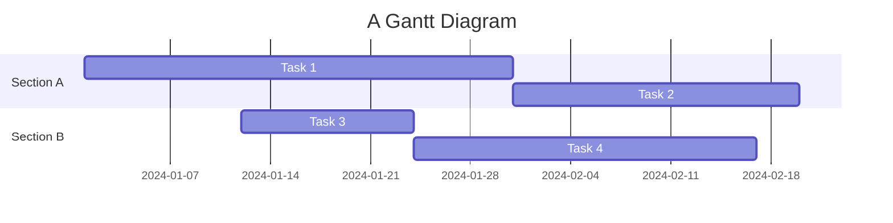
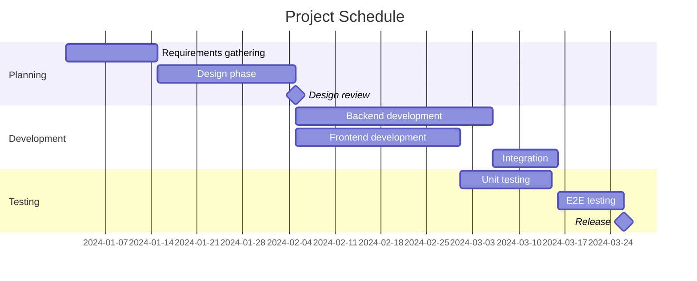
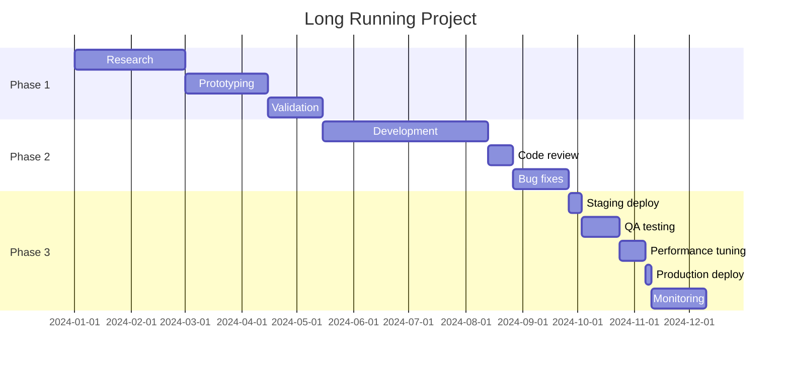

# Mermaid Gantt Chart

## Basic Gantt

```mermaid
gantt
    title A Gantt Diagram
    dateFormat  YYYY-MM-DD
    section Section A
    Task 1           :a1, 2024-01-01, 30d
    Task 2           :after a1, 20d
    section Section B
    Task 3           :2024-01-12, 12d
    Task 4           :24d
```

## Gantt with milestones

```mermaid
gantt
    title Project Schedule
    dateFormat  YYYY-MM-DD
    section Planning
    Requirements gathering :a1, 2024-01-01, 14d
    Design phase           :a2, after a1, 21d
    Design review          :milestone, after a2, 0d
    section Development
    Backend development    :b1, after a2, 30d
    Frontend development   :b2, after a2, 25d
    Integration            :b3, after b1, 10d
    section Testing
    Unit testing           :c1, after b2, 14d
    E2E testing            :c2, after b3, 10d
    Release                :milestone, after c2, 0d
```

## Wide Gantt (many tasks)

```mermaid
gantt
    title Long Running Project
    dateFormat  YYYY-MM-DD
    section Phase 1
    Research           :p1a, 2024-01-01, 60d
    Prototyping        :p1b, after p1a, 45d
    Validation         :p1c, after p1b, 30d
    section Phase 2
    Development        :p2a, after p1c, 90d
    Code review        :p2b, after p2a, 14d
    Bug fixes          :p2c, after p2b, 30d
    section Phase 3
    Staging deploy     :p3a, after p2c, 7d
    QA testing         :p3b, after p3a, 21d
    Performance tuning :p3c, after p3b, 14d
    Production deploy  :p3d, after p3c, 3d
    Monitoring         :p3e, after p3d, 30d
```
