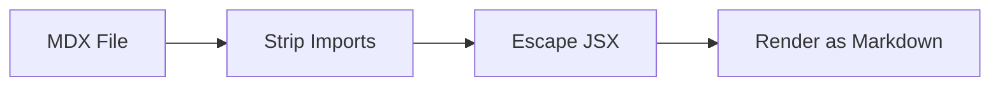

import { Button } from "./components/Button";
import Layout from "./layouts/Layout";
export const meta = { author: "test" };

# Sample MDX File

This is a sample MDX file to test the MDX rendering support in mo.

## Standard Markdown

Regular markdown works as expected:

- **Bold text**
- *Italic text*
- `inline code`
- [Link to example](https://example.com)

## JSX Components

Below are JSX component tags that should be displayed as literal text:

<Button variant="primary">
  Click me
</Button>

<Layout.Header>
  This is a header
</Layout.Header>

<Card />

## Normal HTML

Normal HTML tags should render as usual:

<div style="padding: 1em; border: 1px solid #ccc;">
  This is a div with <strong>bold</strong> text.
</div>

## Code Block

Import/export inside code blocks should be preserved:

```jsx
import React from "react";
export default function App() {
  return <Button>Hello</Button>;
}
```

## Mermaid Diagram


