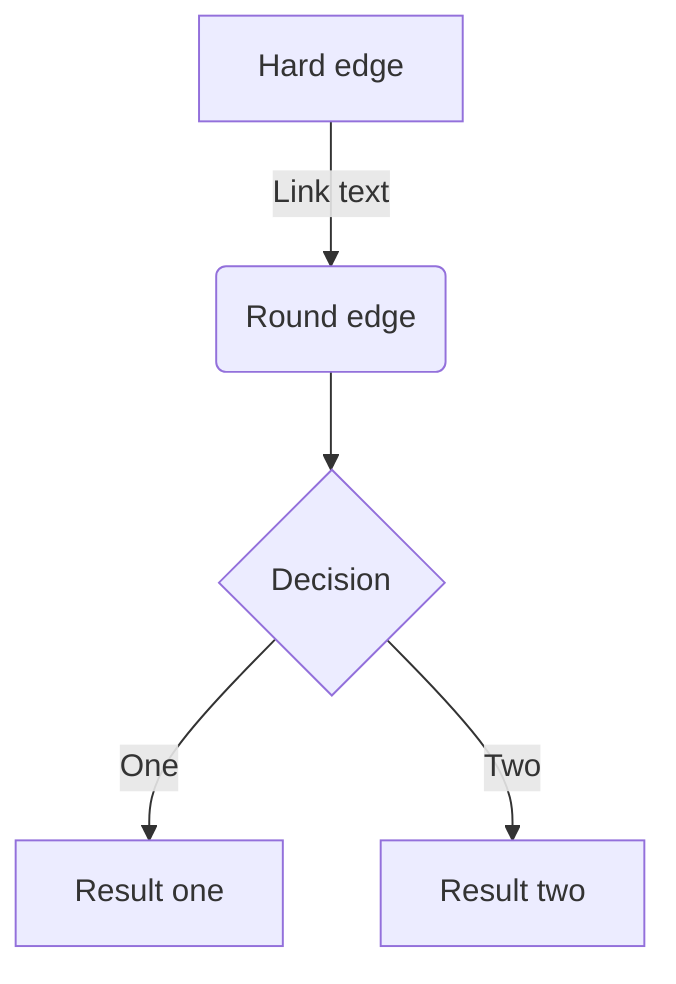

# Zenn記法テスト

## 見出し

### 見出し3

#### 見出し4

## リスト

- Hello!
- Hola!
  - Bonjour!
  - Hi!

1. First
2. Second

## テキストリンク

[アンカーテキスト](https://zenn.dev)

## 画像


### 画像サイズ指定


### キャプション


*キャプションテスト*

## テーブル

| Head | Head | Head |
| ---- | ---- | ---- |
| Text | Text | Text |
| Text | Text | Text |

## コードブロック

```js
const great = "awesome";
```

### ファイル名付き

```js:fooBar.js
const great = "awesome";
```

### diff

```diff js
@@ -4,6 +4,5 @@
+    const great = "awesome";
-    const great = "not so awesome";
```

## 数式 (KaTeX)

インライン: $a\ne0$

ブロック:

$$
e^{i\theta} = \cos\theta + i\sin\theta
$$

## メッセージボックス

:::message
これは通常のメッセージです。
:::

:::message alert
これは警告メッセージです。
:::

## アコーディオン

:::details タイトル
表示したい内容
:::

## リンクカード（裸リンク）

https://zenn.dev

https://github.com/zenn-dev/zenn-editor

## 埋め込み

### カード

@[card](https://zenn.dev)

### YouTube

@[youtube](dQw4w9WgXcQ)

### GitHub Gist

@[gist](https://gist.github.com/octocat/6cad326836d38bd3a7ae)

## タスクリスト

- [x] 完了タスク
- [ ] 未完了タスク

## 脚注

脚注の例[^1]です。インライン^[インライン脚注の内容]で書くこともできます。

[^1]: 脚注の内容です。

## 区切り線

---

## ダイアグラム (Mermaid)



## ネストしたコンテナ

::::details ネストの例
:::message
アコーディオンの中にメッセージボックスをネストできます。
:::
::::

## テキスト装飾

*イタリック*

**太字**

~~打ち消し線~~

インラインの `code` テスト

> 引用テキスト
> 複数行の引用

## インラインコメント

<!-- この行はレンダリングされません -->

上記のHTMLコメントは表示されません。
